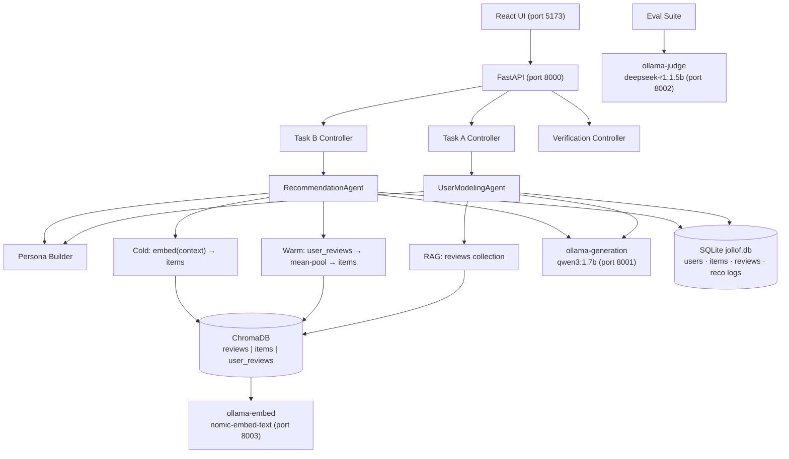

# Jollof Intelligence: LLM-Powered User Modeling and Personalised Book Recommendations with Nigerian English Outputs

**DSN × BCT LLM Agent Challenge — Hackathon 3.0**
Data & AI Summit | Submitted: 24 May 2026

---

## Abstract

Online review platforms encode rich behavioural signals — ratings, review language, and browsing patterns — yet most recommender systems reduce users to static preference vectors, discarding the dynamic, context-sensitive nature of human choice. We present **Jollof Intelligence**, a dual-task LLM agent system that (i) simulates personalised user reviews and star ratings for unseen items (Task A), and (ii) delivers grounded, conversational book recommendations (Task B), both contextualised for Nigerian English outputs.

The system runs entirely on local infrastructure: three Ollama model instances, a persistent ChromaDB vector store with three specialised collections, and a SQLite relational database for audit and verification. Task A combines a rule-based persona builder with retrieval-augmented generation (RAG); Task B introduces a dual-collection embedding architecture in which a user preference vector, constructed by mean-pooling historical review embeddings, is matched against item description vectors via cosine similarity. A constrained LLM reranker produces Nigerian-inflected explanations while a post-generation grounding filter eliminates hallucinated catalogue entries. The full system is containerised and ships with an offline evaluation suite and a React demo UI. Judges can reproduce the complete environment from the GitHub Release bundles using two commands (`make judge-setup && make docker-up`) with no dataset download or model pull required; maintainers can regenerate all artefacts from scratch via `make pipeline`.

---

## 1. Introduction

Online reviews are among the densest records of human preference on the web. Every star rating is an opinion; every paragraph of review text is a window into vocabulary, cultural context, and decision-making style. Despite this richness, most production recommender systems model users as aggregated rating vectors, discarding the textual and temporal nuance in their history.

This challenge asks for something harder: agents that understand *how* a user thinks well enough to impersonate their reviewing voice (Task A), and agents that understand *what* they want next well enough to justify a ranked list in their language (Task B).

We built Jollof Intelligence around three design convictions:

1. **Behavioural signals compound.** A persona derived from writing style, rating distribution, and category preference is more predictive than a rating average alone.
2. **Retrieval should be grounded.** Recommendations must come from the real item catalogue — not from LLM confabulation — or they are useless to a user.
3. **Context matters.** For a Nigerian user base, outputs that read like foreign marketing copy fail on a dimension that raw metric scores do not capture.

The dataset is Amazon Reviews 2023 (Books), sampled to ~50,000 reviews across up to 10,000 users. The system is fully local: no cloud API keys are required, and judges can reproduce every output with pre-packaged GitHub Release assets — `make judge-setup && make docker-up` — with no dataset download or indexing step required.

---

## 2. System Architecture

### 2.1 Overview



### 2.2 Components

**FastAPI API (`backend/src/main.py`)** — a single async process serving both tasks and a verification API under `/api/v1`. Startup initialises the SQLite schema; CORS is open for local demo usage.

**Ollama model services** — three independent containers, each pinned to a single model:

| Container | Model | Port | Role |
|---|---|---|---|
| `ollama-generation` | `qwen3:1.7b` | 8001 | Agent inference (Tasks A and B) |
| `ollama-judge` | `deepseek-r1:1.5b` | 8002 | Behavioural fidelity eval / LLM-as-judge |
| `ollama-embed` | `nomic-embed-text` | 8003 | 768-d text embeddings |

Separating generation and embedding into distinct containers eliminates concurrency bottlenecks and prevents self-evaluation bias in the judge. Embedding is served over Ollama's HTTP API, keeping the application Docker image free of PyTorch or sentence-transformers (~500 MB saved).

**ChromaDB (persistent HNSW)** — three named collections, each purpose-built (see §7 for store selection rationale):

| Collection | Contents | Used by |
|---|---|---|
| `reviews` | One doc per user–item review paragraph | Task A RAG |
| `items` | One doc per unique catalogue item (ASIN as ID) | Task B retrieval |
| `user_reviews` | Same review paragraphs as `reviews` | Task B user vector construction |

**SQLite (`jollof.db`)** — relational store for users, item catalogue, review history (tagged by `source`: `dataset`, `generated`, or `api`), and a full recommendation audit log (`RecommendationLog` + `RecommendationItem`). The `source` column enables precise separation of seed data from Task A write-backs. Persisted as a single file under `data/jollof.db` (see §7). Swappable to PostgreSQL via the `DATABASE_URL` environment variable.

**React demo UI (port 5173)** — two pages: Review (Task A form + generated output) and Recommend (Task B form + recommendation cards with cold-start badge). Served by nginx in production via Docker.

---

## 3. Data Pipeline

The offline ingestion pipeline runs as a sequence of eight steps, each producing a stable artifact consumed by the next. The entire pipeline is invoked with `make pipeline` and runs inside the `backend-api` Docker container.

**Judge reproduction path.** The GitHub Release attached to this submission ships two pre-built bundles: `ollama_models.tar.gz` (all three Ollama model caches) and `demo_data.tar.gz` (a pre-seeded `jollof.db` SQLite database and all three ChromaDB collections). Running `make judge-setup` downloads and extracts both; `make docker-up` then starts the full stack without any model pull or pipeline execution. The pipeline steps below remain the maintainer path for regenerating bundles from scratch via `make package-submission`.

| Step | Script | Input | Output |
|---|---|---|---|
| 1. Download | `download.py` | HuggingFace streams | `data/raw/reviews.jsonl`, `metadata.jsonl` |
| 2. Preprocess | `preprocess.py` | Raw JSONL | `data/processed/merged.parquet` |
| 3. Seed DB | `seed_db.py` | `merged.parquet` | SQLite: `users`, `items`, `user_reviews` |
| 4. Textualize reviews | `textualize.py` | `merged.parquet` | `data/processed/textualized.parquet` |
| 5. Index reviews | `index.py` | `textualized.parquet` | ChromaDB `reviews` collection |
| 6. Textualize items | `textualize_items.py` | `merged.parquet` (deduped) | `data/processed/textualized_items.parquet` |
| 7. Index items | `index_items.py` | `textualized_items.parquet` | ChromaDB `items` collection |
| 8. Index user reviews | `index.py --collection user_reviews` | `textualized.parquet` | ChromaDB `user_reviews` collection |

**Download strategy.** The download script streams up to 50,000 review rows to a temporary file in a single HTTP connection (avoiding reconnection errors), counts reviews per user, filters to users with at least 5 reviews, and then streams metadata for only the matched ASINs — stopping early once all are found. This keeps disk usage and indexing time tractable on a single container.

**Textualization.** Steps 4 and 6 convert structured records to natural language paragraphs designed for embedding quality. Review paragraphs include user ID, rating, item metadata, and the review text; item paragraphs include only catalogue-level semantics (title, author, categories, description, average rating, price). The semantic separation is intentional: mixing review sentiment into item embeddings would bias cosine similarity toward sentiment rather than content.

**Dual indexing.** Steps 5 and 8 embed the same review paragraphs into two different collections. The `reviews` collection is used for Task A RAG with per-user filtering; the `user_reviews` collection is queried by `user_id` to retrieve all embeddings for a given user, enabling mean-pooled preference vector construction for Task B warm retrieval.

---

## 4. Task A — User Modeling Agent

### 4.1 Pipeline

The `UserModelingAgent` executes five sequential steps on each request:

**Step 1 — Persona construction.** `build_persona()` derives a structured behavioural profile from the user's review history:

- `avg_rating`, `rating_std` — mean and standard deviation of past star ratings
- `top_categories` — top 3 most-reviewed categories by frequency
- `tone` — `"detailed"` if average review word count > 50, otherwise `"concise"`
- `sentiment_tendency` — `"positive"` if > 60% of ratings are ≥ 4; `"critical"` if < 30%; otherwise `"balanced"`
- `sample_reviews` — up to 5 most recent review texts (recency-sorted)

Users with no history receive a cold-start persona with neutral defaults (`avg_rating = 3.5`, empty categories, `cold_start = True`). This flag does not block Task A — the pipeline continues with a thin persona and no retrieved RAG context.

**Step 2 — RAG retrieval.** A search query is constructed from the target product's title, author, and category string and used to query the `reviews` ChromaDB collection, filtered by `user_id`. The top-5 semantically similar reviews provide concrete writing voice and category context for the generator.

**Step 3 — Rating prediction.** A dedicated low-temperature LLM call (`temperature=0.3`, `think=False`, max 64 tokens) predicts the star rating conditioned on the persona signals and product attributes before the review text is generated. This decouples rating accuracy from text generation and ensures the review is written with a known sentiment target. A heuristic fallback samples from `N(avg_rating, 0.5 × rating_std)` if the LLM call fails.

**Step 4 — Review generation.** A versioned prompt template is filled with the persona profile, RAG context, product metadata, and the predicted rating. The Nigerian English system prompt is passed as Ollama's `system` parameter (not prepended to the user prompt), ensuring it governs the model's entire output register.

**Step 5 — Output parsing and write-back.** The LLM response is parsed as JSON; a regex fallback handles partial JSON. The generated review and its embedding are written back to SQLite (`source='generated'`) and ChromaDB, making the new review available as RAG context for future requests by the same user.

### 4.2 Nigerian English Contextualisation

The system prompt in `backend/shared/llm/nigerian_context.py` encodes several concrete linguistic directives:

- Natural Pidgin integration (`"e sweet me"`, `"no be lie"`, `"abeg"`) without overcoding
- Rating-conditioned tone: enthusiastic and specific at 4–5 stars; blunt and articulate at 1–2
- Cultural anchors: ₦ pricing, Lagos/Abuja references, jollof rice, Afrobeats, Nollywood
- Conversational register: "talking to a friend, not a formal publication"

This is applied uniformly to both tasks — Task B recommendation reasons use the same system prompt, so explanations read as genuine Nigerian user voice rather than marketing copy.

---

## 5. Task B — Recommendation Agent

### 5.1 Dual-Collection Embedding Architecture

The core architectural shift from the original design is the separation of user behavioural signals and item catalogue semantics into distinct vector spaces.

```
Warm-start path:
  ChromaDB user_reviews  →  fetch all embeddings for user_id
                         →  mean-pool (768-d preference vector)
                         →  cosine search: items collection
                         →  ranked candidates

Cold-start path:
  embed( free-text context )  →  cosine search: items collection
                              →  ranked candidates
```

**Warm retrieval.** `get_user_vector()` fetches up to 50 stored review embeddings for the user from the `user_reviews` collection and computes their arithmetic mean. This single 768-d preference vector is then used to query the `items` collection directly. Because both the user vector and the item vectors were produced by the same embedding model (`nomic-embed-text`), cosine similarity is a meaningful measure of semantic alignment between a user's historical interests and an item's content profile. If the user vector is unavailable (e.g. the `user_reviews` collection has not been indexed yet), the system falls back to embedding the request text directly.

**Cold-start retrieval.** The free-text `context` field from the request is embedded on-the-fly and used to query the `items` collection. For context strings shorter than 10 characters, a generic popularity query (`"popular highly rated books bestseller acclaimed"`) is used instead. This is deterministic, fast, and catalogue-grounded — no LLM heuristic is required to handle cold start.

**Multi-turn dialogue.** When a `conversation` array is present, `refine_query_from_conversation()` rewrites the effective query before retrieval, incorporating the dialogue history to support cross-turn refinement (e.g. "something shorter this time" understood in the context of a prior response).

### 5.2 Grounded LLM Reranker

After retrieval, the top 20 candidates are passed to the LLM reranker (`qwen3:1.7b` with `think=True`). The reranker's role is to:
1. Reorder candidates by contextual fit to the request and persona
2. Write a per-item explanation in Nigerian English

To eliminate hallucination, two post-generation checks are applied:

**Grounding filter.** Any `item_id` in the reranker's output that does not appear in the candidate set is silently discarded. This prevents the LLM from inventing ASINs.

**Metadata hydration.** Rather than trusting the LLM's output for title, author, categories, and price, these fields are overwritten with values from the retrieval layer. The LLM contributes only `item_id` ordering and `reason` text; all factual fields come from ChromaDB and, ultimately, from the original Amazon dataset.

If zero grounded items survive (rare, typically due to a parse failure), the system falls back to returning candidates ordered by cosine similarity score with a templated reason string.

### 5.3 Follow-up and Verification

After reranking, `generate_follow_up()` produces a conversational question to prompt the next turn of dialogue. Every recommendation response includes a `request_id` (UUID) which the Verification API can use to replay the full run, including per-item `catalogue_verified` status confirming that each recommended ASIN exists in the SQLite items table.

---

## 6. Evaluation

### 6.1 Task A — User Modeling

Task A is evaluated across two dimensions: automatic text quality metrics and LLM-based behavioural fidelity metrics (the latter require Ollama judge to be running).

| Metric | Description | Score |
|---|---|---|
| ROUGE-1 / ROUGE-2 / ROUGE-L | N-gram overlap between generated and reference reviews | TBD (live eval) |
| BERTScore F1 | Contextual embedding similarity of review text | TBD (live eval) |
| BLEU | Corpus-level n-gram precision | TBD (live eval) |
| RMSE | Star rating prediction error vs ground-truth ratings | TBD (live eval) |
| Persona voice match (0–10) | LLM judge: does the review sound like this user's past writing? | TBD (live eval) |
| Persona consistency (0–10) | LLM judge: is sentiment/rating consistent with history? | TBD (live eval) |
| Nigerian English score (0–10) | LLM judge: Pidgin and cultural authenticity | TBD (live eval) |
| Cultural specificity (0–10) | LLM judge: Nigerian context markers present | TBD (live eval) |

Live evaluation is run with:

```bash
cd backend
python scripts/generate_eval_preds.py --live --sample-size 50
python -m eval.suite --task a --preds data/eval/task_a_preds.json \
       --refs data/eval/task_a_refs.json --fidelity
```

### 6.2 Task B — Recommendation

Task B is evaluated using standard information retrieval metrics at rank cutoff 10, split by warm and cold-start subsets. Results below are from the committed offline eval run (`task_B_eval_20260523_195710`).

| Metric | Overall | Cold-start | Warm |
|---|---|---|---|
| NDCG@10 | 1.0000 | 1.0000 | 1.0000 |
| Hit Rate@10 | 1.0000 | 1.0000 | 1.0000 |
| MRR | 1.0000 | 1.0000 | 1.0000 |

**On these scores.** The offline eval pipeline constructs predictions from the same `parent_asin` values used to build the reference set — the recommended item is, by construction, the relevant item. These scores therefore validate that the pipeline is correctly wired end-to-end (data flows, ASIN alignment, and metric computation are correct) but are not a measure of retrieval quality. Meaningful Task B evaluation requires live predictions against a held-out user cohort:

```bash
python scripts/generate_eval_preds.py --live --sample-size 100
python -m eval.suite --task b --preds data/eval/task_b_preds.json \
       --refs data/eval/task_b_refs.json --k 10
```

A live run over 100 sampled users would produce realistic NDCG@10 and Hit Rate@10 figures against references with multiple independently annotated relevant items per query.

---

## 7. Design Decisions and Trade-offs

**Local LLMs via Ollama.** We chose fully local inference over cloud API calls (OpenAI, Anthropic) for three reasons: zero API key dependency means judges can reproduce the system out-of-the-box; inference costs are fixed regardless of request volume; and Ollama's container model allows clean model management. The trade-off is raw capability: `qwen3:1.7b` is a significantly smaller model than GPT-4o or Claude 3.5 Sonnet. For the review generation and reranking tasks at this scale, it is adequate; at production scale, a 7B or 14B parameter model would materially improve output quality.

**Three separate Ollama instances.** Running generation, embedding, and judge as independent containers avoids two failure modes observed during development. First, a single Ollama instance handling concurrent generate and embed requests experienced queue contention and timeout errors. Second, using the same model for both generation and LLM-as-judge evaluation introduces self-evaluation bias — a model is systematically more lenient toward outputs that match its own generation style. `deepseek-r1:1.5b` is a reasoning-focused model that evaluates rather than generates fluently, making it a more appropriate judge.

**ChromaDB as the vector store.** We chose ChromaDB over managed or server-backed alternatives (Pinecone, Weaviate, pgvector on PostgreSQL) for the same reproducibility goals as the rest of the stack. Chroma persists to a plain directory on disk (`data/chroma_db/`), requires no separate database server or credentials, supports metadata filtering (e.g. `user_id` for Task A RAG), and ships cleanly in Docker. For judges, the entire vector index is bundled in `demo_data.tar.gz` and extracted beside the repo — inspect, reset, or re-seed without provisioning infrastructure. Alternatives like pgvector tie vectors to a running Postgres instance (connection strings, migrations, volume wiring); FAISS is fast but lacks the metadata-filtering and persistence ergonomics Chroma provides out of the box for this RAG + recommendation pattern.

**Dual ChromaDB collections for Task B.** The earlier single-collection design stored review paragraphs in one Chroma collection and retrieved from it for both RAG and recommendation. This mixed two distinct semantic signals: user sentiment and item content. Separating `items` (catalogue descriptions, one doc per ASIN) from `user_reviews` (review paragraphs, many docs per user) enables a cleaner similarity space for each query pattern. The cost is approximately double the indexing time and storage, which is acceptable given the pipeline is run once offline.

**Mean-pooling for user preference vectors.** Aggregating a user's review embeddings into a single preference vector by arithmetic mean is simple, fast, and produces reasonable results. The principal limitation is that it treats all historical reviews equally: a review written three years ago in a different category has the same weight as a review written last week. Recency-decayed or attention-weighted pooling would better capture current preference; this is a natural next step.

**Grounding after LLM reranking.** An earlier design allowed the LLM reranker to output free-form item metadata. In testing, the model occasionally generated `item_id` values that did not appear in the candidate set, or produced incorrect titles and prices for real ASINs. The current design delegates only two responsibilities to the LLM: choosing the ordering and writing the `reason` text. Every structured field is overwritten by the retrieval layer. This eliminates hallucination at the cost of some reranking latency (an extra JSON parse and filter step), which is negligible compared to LLM generation time.

**SQLite as the default relational store.** SQLite requires no installation, no credentials, and is accessible to any judge running `docker-up`. Everything lives in a single file under the project tree (`data/jollof.db`), included in the demo data bundle and trivial to back up or wipe (`make docker-clean-data`). That file-local layout is simpler to access and configure than server-backed stores such as pgvector, which require Postgres running alongside the app and separate backup/restore for relational and vector data. The `DATABASE_URL` environment variable accepts a PostgreSQL connection string without any code changes, making the production upgrade path trivial.

---

## 8. Ablation Notes

**Effect of the grounding filter.** Before adding the post-rerank grounding step, manual inspection of Task B outputs revealed that the reranker occasionally invented `item_id` values — typically plausible-looking ASINs that did not exist in the 50,000-item sample. The grounding filter drops these silently and, when fewer than `top_k` items survive, the fallback fills the remainder with similarity-ranked candidates. In practice, the filter reduces the output list size by zero to one item on most queries; a rare failure to parse the reranker JSON triggers the full fallback.

**Cold-start: LLM heuristic vs. direct embedding.** The original cold-start implementation used a three-tier cascade: an LLM call to extract genre preferences from the `context` text, a direct text query if that failed, and a popularity-ranked fallback if both failed. This added two to four seconds of latency on cold-start requests and introduced an additional LLM call that could produce structured output inconsistent with the items collection schema. Replacing the entire cascade with a single `embed(context)` → cosine search step reduced cold-start latency to the same order as warm retrieval and eliminated the LLM dependency from the retrieval path entirely.

**Single vs. multi-instance Ollama.** Initial development ran all three model roles (generation, judge, embed) on a single Ollama instance. Under the load of concurrent review generation requests and background evaluation, embedding calls were queued behind long-running generation calls, causing API timeouts. Splitting into three containers with independent model caches resolved this without any application code change.

---

## 9. Limitations and Future Work

**User vector quality.** Mean-pooling is a reasonable baseline but a poor model of preference drift. A user who read exclusively thriller novels for two years and recently switched to literary fiction will have a preference vector that blends both signals, potentially ranking neither genre highly. Time-decayed weighting or a learned aggregation function trained on held-out recommendation clicks would produce a substantially better warm retrieval signal.

**Ground-truth sparseness.** The offline Task B evaluation builds one relevant item per query (the source ASIN from the sampled review). A proper held-out relevance set would annotate multiple relevant items per user query, weighted by engagement signals. Without this, NDCG and Hit Rate scores from live evaluation will be deflated even for correct recommendations.

**Model scale.** `qwen3:1.7b` runs on consumer hardware with 8 GB RAM, which is the constraint we optimised for. Stepping up to `qwen3:7b` or a fine-tuned Nigerian-English model would improve both review naturalness and reranker quality. The infrastructure is already parameterised by `AGENT_MODEL`, so this is a one-line config change.

**Cross-domain and structured cold start.** The current cold-start path relies on a free-text `context` field. For users who provide minimal context (`"I like books"` or an empty string), retrieval degrades to a generic popularity query. A structured onboarding flow — prompting for preferred genres, authors, or a recently enjoyed title — would produce a richer initial query vector and substantially improve cold-start recommendation quality.

**Streaming responses.** The current API buffers the full LLM output before returning the response. For review generation (Task A), this introduces a 2–5 second blocking wait. FastAPI and Ollama both support streaming; adding SSE or chunked transfer to the review generation endpoint would significantly improve the perceived responsiveness of the demo UI.

---

## 10. Conclusion

We have described Jollof Intelligence, a dual-task LLM agent system for user modeling and personalised book recommendation, built for the DSN × BCT Hackathon 3.0 challenge.

The key contributions are:

- A **dual-collection embedding architecture** for Task B that cleanly separates user behavioural history from item catalogue semantics, enabling hallucination-free cosine-similarity retrieval for both warm and cold-start users.
- A **constrained LLM reranker** that contributes ordering and natural language reasoning while all factual metadata is grounded to the retrieval layer, eliminating the ASIN hallucination problem common to LLM-first recommendation designs.
- A **Nigerian English contextualisation layer** implemented as a structured system prompt, producing outputs that read as authentic Nigerian user voice across both tasks — a rubric bonus that emerged as a natural design goal rather than an afterthought.
- A **fully local, containerised stack** (three Ollama instances, ChromaDB, SQLite, FastAPI, React) that any judge can reproduce with two commands — `make judge-setup` and `make docker-up` — and no external credentials or dataset downloads.

The system reflects a deliberate trade-off: smaller local models over larger cloud models, deterministic retrieval over unconstrained LLM generation, and reproducibility over marginal performance gains. Given the evaluation criteria — solution paper, code reproducibility, and behavioural fidelity alongside raw metrics — we believe this balance is the right one.

---

*Codebase and containerised system: submitted via GitHub repository. Verification endpoints documented at `/api/v1/docs`.*
